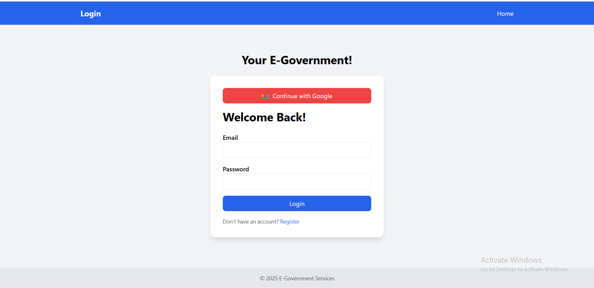

# E-Government Citizen Services Portal

The E-Government Citizen Services Portal is a web application that enables citizens to apply for various government services online—without visiting offices. Users can submit requests for services like passport renewal, national ID updates, business licenses, or land registration, upload required documents, pay fees (simulated), and track the status of their requests. Government officers and admins can review, process, and manage all requests efficiently.



[🚀 Live Demo on Render](#) <!-- Replace # with your live URL -->

## 💡 Key Features

- 👤 Multi-user types: Citizens, Officers, Department Heads, Admins
- 📝 Service Requests: Submit, track, and manage requests
- 📄 Document Upload: PDF/JPG uploads for applications
- 💰 Payment Simulation: Fake payment success page for fee-based services
- 🔍 Search & Filter: By name, request ID, status, service type, and date
- 🔔 Notifications: Citizens notified when request status changes
- 📊 Reports & Statistics: Admins can view request counts,and approvals/rejections
- 🏢 Multi-department support: Each department sees only its requests; admin sees all
- 🌐 Responsive design using EJS templates and Tailwind CSS

## ⚙️ Implementation Outline

### Built With

- **Frontend**: EJS templates, Tailwind CSS
- **Backend**: Node.js, Express.js
- **Database**: PostgreSQL
- **Authentication**: Passport.js (local and Google OAuth)
- **File Uploads**: Multer

### Setup Instructions

1. **Clone the repository**

```bash
git clone https://github.com/elhamatokhi/Capstone.git
cd e-government-portal
```

Install dependencies:

```bash
npm install
```

Create .env file with database credentials and session secret

```bash
DB_USER=your_db_user
DB_PASSWORD=your_db_password
DB_HOST=localhost
DB_PORT=5432
DB_NAME=your_db_name
SESSION_SECRET=your_secret_key
PORT=3000
```

Run the application

node index.js

Start the server:

```bash
nodemon index.js
```

The app will be live at http://localhost:3000

## Documentation

For detailed usage and developer guidelines, see the [Project Wiki](https://github.com/elhamatokhi/Capstone/wiki)

Image & Asset Attribution

Government service icons: Custom or sourced appropriately

File and document icons: Open source assets

License

This project is licensed under the MIT License
